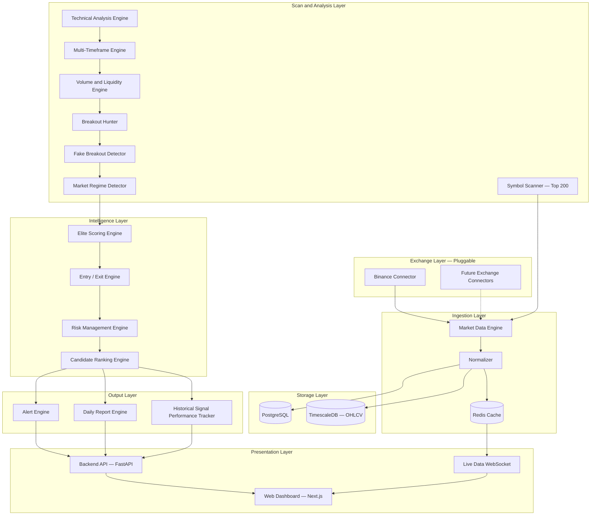
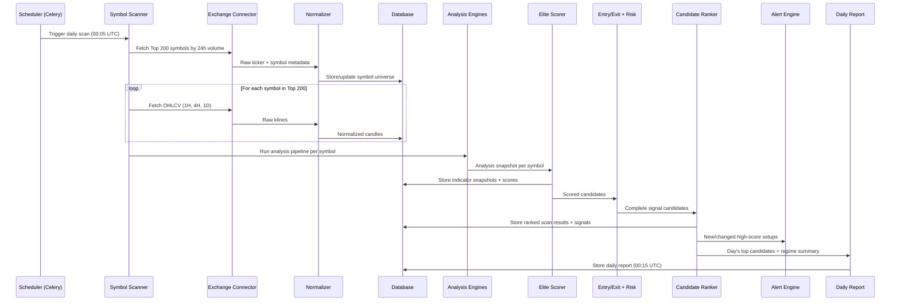

# ECPX Architecture

This document describes the system architecture for Elite Crypto Platform X v1.0.

> **Milestone 0:** This is design documentation only. No application code exists yet.

## Design Principles

1. **Read-only by design** — No order execution path exists in v1.
2. **Exchange-agnostic data layer** — Binance details never leak into analysis or scoring logic.
3. **Pipeline architecture** — Each engine does one job; stages are independently testable.
4. **Configuration over hardcoding** — Weights, thresholds, and rules live in `config/` YAML files.
5. **Immutable signal snapshots** — Signals are stored with full context; outcomes tracked separately.
6. **Scheduled + on-demand** — Daily full scan plus 4H/1D confirmation passes.

## System Layers



## Monorepo Layout

| Path | Role | Milestone |
|------|------|-----------|
| `apps/api/` | FastAPI REST + WebSocket server | M2+ |
| `apps/scanner/` | Celery workers and scan pipeline | M3+ |
| `apps/web/` | Next.js dashboard | M8+ |
| `packages/core/` | Shared domain models and enums | M1+ |
| `packages/connectors/` | Exchange adapter interfaces | M1+ |
| `packages/market_data/` | Market Data Engine + Normalizer | M1+ |
| `packages/analysis/` | TA, breakout, regime engines | M4+ |
| `packages/intelligence/` | Scoring, entry/exit, ranking | M6+ |
| `packages/output/` | Alerts, reports, performance | M9+ |
| `config/` | YAML configuration files | M0 |
| `docs/` | Architecture and product docs | M0 |
| `scripts/` | CLI and maintenance scripts | M1+ |

## Technology Stack

### Backend (scanning and analysis)

| Component | Choice |
|-----------|--------|
| Language | Python 3.12+ |
| API framework | FastAPI |
| Task scheduler | Celery + Redis |
| TA libraries | pandas, pandas-ta or TA-Lib |
| Exchange library | ccxt (primary) |
| Validation | Pydantic |

### Frontend (dashboard)

| Component | Choice |
|-----------|--------|
| Framework | Next.js 14+ (App Router) |
| Language | TypeScript |
| UI | Tailwind CSS + shadcn/ui |
| Charts | Lightweight Charts (TradingView) |
| Real-time | WebSocket client |

### Data and infrastructure

| Component | Choice |
|-----------|--------|
| Primary DB | PostgreSQL |
| Time-series OHLCV | TimescaleDB (PostgreSQL extension) |
| Cache / queue | Redis |
| Local infra | Docker Compose (postgres + redis) |

## Data Flow — Daily Scan Cycle



## Scanner Job Types

| Job | Schedule | Purpose |
|-----|----------|---------|
| `universe_scan` | Daily | Build Top 200, detect new coins |
| `full_scan` | Daily after universe | Full pipeline on all 200 |
| `confirmation_scan` | Every 4H / 1D close | Re-evaluate open candidates |
| `intraday_refresh` | Every 15–30 min | Update live scores for watchlist |
| `performance_resolve` | Daily | Check historical signal outcomes |

## Connector Design (Exchange-Agnostic)

```
AbstractExchangeConnector
├── get_symbols() → List[RawSymbol]
├── get_ticker_24h() → List[RawTicker]
├── get_klines(symbol, timeframe, limit) → List[RawKline]
├── get_order_book(symbol, depth) → RawOrderBook
└── subscribe_klines(symbols, timeframe) → AsyncStream

BinanceConnector implements AbstractExchangeConnector
FutureConnector implements AbstractExchangeConnector
```

The **Normalizer** converts every raw exchange object into internal domain models. Analysis code never imports exchange-specific types.

## Configuration Files

| File | Purpose |
|------|---------|
| `config/scoring_weights.yaml` | Elite Score factor weights |
| `config/scan_criteria.yaml` | Top 200 filters, pre-filters, report schedule |
| `config/alert_rules.yaml` | Alert trigger definitions and dedup rules |

## Security Principles

1. No trading API keys with write permissions in v1.
2. Secrets only in `.env` — never committed to Git.
3. HTTPS only in production.
4. Rate limiting on all external API calls.
5. Central rate limiter (Redis token bucket) shared across workers.

## Related Documentation

- [VISION.md](VISION.md) — Product goals
- [DATA_MODEL.md](DATA_MODEL.md) — Entity definitions
- [SCORING.md](SCORING.md) — Elite Score architecture
- [BINANCE.md](BINANCE.md) — Binance API strategy
